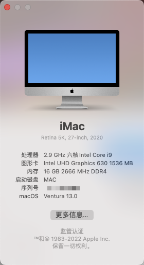

# i5-10400-ex-b460m-v5-hackintosh

配置： 
CPU：i5 10400 
主板：Asus EX-B460M-V5 
内存：8G\*2 2666 
硬盘：SN 550 256G 
显卡：HD630 
网卡：bcm94360cd 

bios 设置： 
vx-d：关闭 
快速启动：关 
启动模式：其他操作系统 
csm：关 
安全密钥：已经清除 

重新生成三码使用！

MacOS Monterey 无痛升级 

